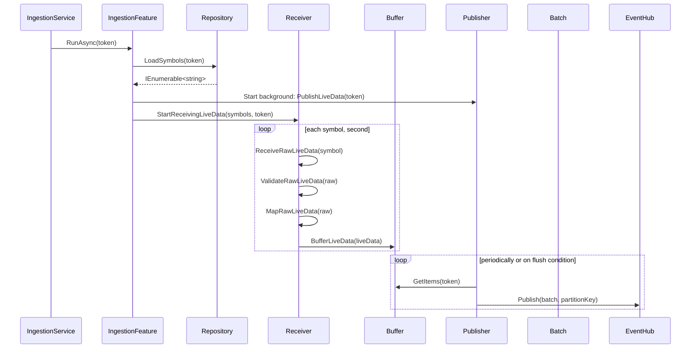

# System Design
# Live Data Ingestion

 
###  1. Receiver → Buffer 
Operation: Adds item to a BlockingCollection.

🔁 Latency: ~10–30 µs (negligible)

⚡ Throughput: ~500k–1M ticks/sec (receiver thread can ingest this easily)

✅ Handles burst ingestion (e.g., 10,000 ticks in 100ms burst)

✅ Zero blocking unless buffer is full

### 2. Buffer → Publisher → Batch Creation
Operation: Publisher pulls from buffer and accumulates ticks into a list.

⏳ Latency:

Controlled by:

BatchSizeThreshold = 250

PublishIntervalThreshold = 100ms

→ If batch fills quickly: ~20–40ms

→ Otherwise: capped at 100ms wait

📦 Throughput:

If 4 publishers run in parallel, each sending 250 ticks per 100ms →

4 x 250 x 10 = 10,000 ticks/sec

(scales linearly with parallelism)


---
- Blazor UI
  -  Display real-time price updates
- MarketDataService
- Message Broker
  - Technology: Azure Event Hub (low latency, high truoghpot)
  - Auth: Azure AD + Managed Identity + RBAC + Policy
  - Security: Private Endpoint + Network Rules allows only AKS subnets, Key Voult
  - Scale: Premium + Event Hub/domain + Partoition/symbol + Consumer Groups/service +  auto-inflate
  - Regulatory: 48h retention, Audit Trail by Azure Monitor
  - Observability: Azure Monitor, App Insight, diagnostic, alerting
  
- MarketDataIngestorService
  - Technology: BackgroundService 
  - Host: Azure VM for Dev, AKS for prod 
  - Authentication: Azure AD + Managed Identity + RBAC
  - Security: only its AKS subnets can access event hub or Key Vaoult
  - Scale: 
  - Regulatory: 
  - Observability: Azure Monitor, App Insight, diagnostic, alerting
  - decopeling: ingestion from bradcasting via BlockingCollection
  - 
  - Requires persistent, low-latency connection to Bloomberg via BLPAPI
  - Publishes real-time data to Azure Event Hub
  - Must be resilient and log-friendly
  - Has native SDK dependencies (e.g. blpapi.dll)
  - BackgroundService
  - It uses Bloomberglp.Blpapi;
- Market Data Provider
  - Bloomberg
  - BLPAPI is the event-driven realtime and historical data SDK  
    - B-PIPE for prod (low-latency, server-to-server feed)
    - Bloomberg Terminal for dev and test
  
---

## 🎯 Business Goal (Level 1)

**As a Trader, I want to see live market data so I can decide whether to place a trade.**

---

## 💵 Business Strategy (Level 2)

Access real-time price updates for relevant instruments as soon as they change.

---

## 🛠️ High-Level Tactical System Design (Level 3)

🔴 **Problem:** The trader has no way to view live market movements.  
✅ **Solution:** Add a `Blazor UI – Live Market Data View` to display real-time price updates.

> This is the only component introduced at this stage — the first point of user-system interaction.

---

## 🔍 System Design Diagram

```mermaid
graph TD
    Trader[Trader]
    UI[Blazor UI – Live Market Data View]

    Trader --> UI
